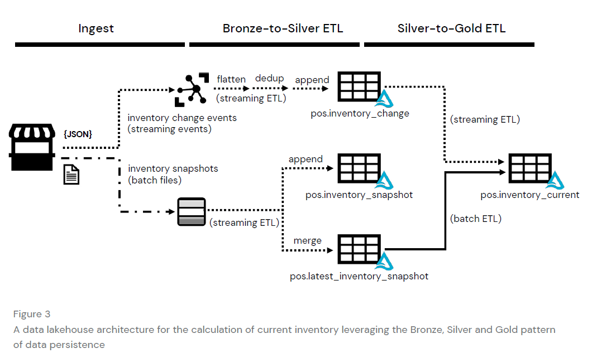

**Este proyecto tratará sobre el Análisis de Punto de Venta en Tiempo Real.**  
>Problemática:  
La necesidad de datos en tiempo real en el segmento retail y como superar los desafíos del streaming de datos del punto de venta a escala con un datalakehouse.  
###Enfoque Técnico:  
El enfoque data lakehouse permite emplear múltiples modos de transmisión de datos en paralelo: streaming para datos de alta frecuencia e insert-oriented, y procesos por lotes o batch para eventos menos frecuentes y de mayor escala. Esto comunmente es referido como arquitecturas lambda.  
Se utilizará la arquitectura lambda junto con medallion con el patrón de diseño Bronze, Silver y Gold para aterrizar los datos en etapas.  

